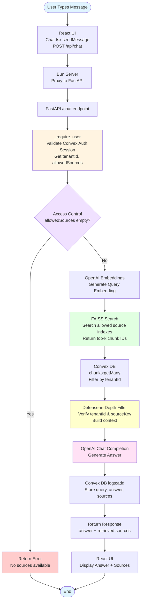

# User Query Process Flow

## Key Access Control Points

1. **Authentication** (`_require_user`): Validates Convex Auth token and retrieves user info
2. **Source Filtering** (`get_allowed_sources`): Admins get all sources, members get their assigned sources
3. **FAISS Index Selection**: Only searches indexes for user's allowed sources
4. **Tenant Filtering**: Convex query filters chunks by tenantId at database level
5. **Defense-in-Depth**: Double-checks tenantId and sourceKey before building context

## Components Involved

- **Frontend**: React UI (Chat.tsx) - User interface
- **Bun Server**: Proxy layer forwarding requests
- **FastAPI**: Main API handling chat queries
- **Convex**: Database and authentication
- **FAISS**: Vector similarity search
- **OpenAI**: Embeddings and chat completion
